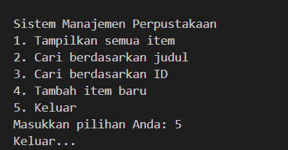

# Sistem Manajemen Perpustakaan Sederhana

## Deskripsi Program
Program ini adalah sistem manajemen perpustakaan sederhana yang dibuat menggunakan konsep Object-Oriented Programming (OOP) di Python. Program ini mengimplementasikan konsep-konsep seperti abstract class, inheritance, encapsulation, dan polymorphism.

## Fitur Utama
- **Menambahkan Item**: Menambah buku atau majalah ke dalam perpustakaan secara interaktif.
- **Menampilkan Daftar Item**: Menampilkan semua item yang ada di perpustakaan.
- **Mencari Item**: Mencari item berdasarkan judul (case-insensitive) atau ID.

## Struktur OOP
- **LibraryItem**: Abstract class sebagai dasar untuk semua item perpustakaan.
- **Book**: Subclass untuk buku, mewarisi dari LibraryItem.
- **Magazine**: Subclass untuk majalah, mewarisi dari LibraryItem.
- **Library**: Class untuk mengelola koleksi item.

## Konsep yang Diterapkan
- **Abstract Class dan Inheritance**: LibraryItem sebagai abstract class, Book dan Magazine mewarisi darinya.
- **Encapsulation**: Menggunakan access modifiers (_ untuk protected, __ untuk private) untuk melindungi data.
- **Polymorphism**: Method display_info() diimplementasikan berbeda di setiap subclass.
- **Property Decorator**: Digunakan untuk atribut item_id dan title di LibraryItem, serta atribut lainnya di subclass.

## Cara Menjalankan
1. Pastikan Python terinstall di sistem.
2. Jalankan file `library_system.py` dengan perintah:
   ```
   python library_system.py
   ```
3. Ikuti menu yang muncul untuk berinteraksi dengan sistem.

## Diagram Class (Opsional)
```
LibraryItem (Abstract)
├── item_id (property)
├── title (property)
└── display_info() (abstract)

├── Book
│   ├── author (property)
│   ├── year (property)
│   └── display_info()
│
└── Magazine
    ├── issue (property)
    ├── publisher (property)
    └── display_info()

Library
├── __items (private)
├── add_item()
├── display_items()
├── search_by_title()
└── search_by_id()
```

## Screenshots

Berikut adalah screenshot dari aplikasi Sistem Manajemen Perpustakaan:

### Tampilan Utama


### Tampilkan Semua Item


### Cari Berdasarkan Judul


### Cari Berdasarkan ID


### Tambah Item Baru


### Keluar
